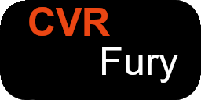

<!-- PROJECT SHIELDS -->

<!--
*** I'm using markdown "reference style" links for readability.
*** Reference links are enclosed in brackets [ ] instead of parentheses ( ).
*** See the bottom of this document for the declaration of the reference variables
*** for contributors-url, forks-url, etc. This is an optional, concise syntax you may use.
*** https://www.markdownguide.org/basic-syntax/#reference-style-links
-->

[![Contributors][contributors-shield]][contributors-url]
[![Forks][forks-shield]][forks-url]
[![Stargazers][stars-shield]][stars-url]
[![Issues][issues-shield]][issues-url]
[![LGPL2 License][license-shield]][license-url]

<!-- PROJECT LOGO -->

 

  

<h3 align="center">CVR Fury</h3>

     
    <a href="https://docs.cvrfury.uk/"><strong>Explore the docs »</strong></a>
     
     
    <a href="https://github.com/NovaVoidHowl/CVRFury-Compiled-Components/issues">Report Bug</a>
    ·
    <a href="https://github.com/NovaVoidHowl/CVRFury-Compiled-Components/issues">Request Feature</a>
  

<!-- TABLE OF CONTENTS -->

  
Table of Contents

  <ol>
    <li>
      <a href="#about-the-project">About The Project</a>
    </li>
    <li><a href="#contributing">Contributing</a></li>
    <li><a href="#license">License</a></li>
    <li><a href="#contact-and-links">Contact and Links</a></li>
    <li><a href="#project-tools">Project tools</a></li>
  </ol>

<!-- ABOUT THE PROJECT -->

## About The Project

This repo holds the build code for compiled DLLs used in CVRFury.\
The DLLs created from the code are bundled in the CVRFury codebase and do
not need to be downloaded from here for normal use.

**Please see the [CVRFury docs site](https://docs.cvrfury.uk/) for install/setup guidance and further information on CVRFury**

(<a href="#readme-top">back to top</a>)

<!-- CONTRIBUTING -->

## Contributing

Contributions are what make the open source community such an amazing place to learn, inspire, and create.
Any contributions you make are **appreciated**. Please see [CONTRIBUTING.md](CONTRIBUTING.md) for more details.

If you have a suggestion that would make this better, please fork the repo and create a pull request.
You can also simply open an issue with the tag "enhancement".

1. Fork the Project
2. Create your Feature Branch (`git checkout -b feature/AmazingFeature`)
3. Commit your Changes (`git commit -m 'Add some AmazingFeature'`)
4. Push to the Branch (`git push origin feature/AmazingFeature`)
5. Open a Pull Request

(<a href="#readme-top">back to top</a>)

<!-- LICENSE -->

## License

Please see [LICENSE.md](LICENSE.md) for information.

(<a href="#readme-top">back to top</a>)

<!-- CONTACT -->

## Contact and Links

[@NovaVoidHowl](https://novavoidhowl.uk/)

Documentation Link [https://docs.cvrfury.uk](https://docs.cvrfury.uk)

(<a href="#readme-top">back to top</a>)

<!-- PROJECT TOOLS -->

## Project tools

- VS Code, IDE
- Visual Studio, IDE
- Pre-Commit, linting and error detection
- Github Copilot, Code error/issue analysis

(<a href="#readme-top">back to top</a>)

<!-- MARKDOWN LINKS & IMAGES -->

<!-- https://www.markdownguide.org/basic-syntax/#reference-style-links -->

[contributors-shield]: https://img.shields.io/github/contributors/NovaVoidHowl/CVRFury-Compiled-Components.svg?style=plastic
[contributors-url]: https://github.com/NovaVoidHowl/CVRFury-Compiled-Components/graphs/contributors
[forks-shield]: https://img.shields.io/github/forks/NovaVoidHowl/CVRFury-Compiled-Components.svg?style=plastic
[forks-url]: https://github.com/NovaVoidHowl/CVRFury-Compiled-Components/network/members
[issues-shield]: https://img.shields.io/github/issues/NovaVoidHowl/CVRFury-Compiled-Components.svg?style=plastic
[issues-url]: https://github.com/NovaVoidHowl/CVRFury-Compiled-Components/issues
[license-shield]: https://img.shields.io/badge/License-LGPL_2.1-blue
[license-url]: https://github.com/NovaVoidHowl/CVRFury-Compiled-Components/blob/master/LICENSE.md
[stars-shield]: https://img.shields.io/github/stars/NovaVoidHowl/CVRFury-Compiled-Components.svg?style=plastic
[stars-url]: https://github.com/NovaVoidHowl/CVRFury-Compiled-Components/stargazers
